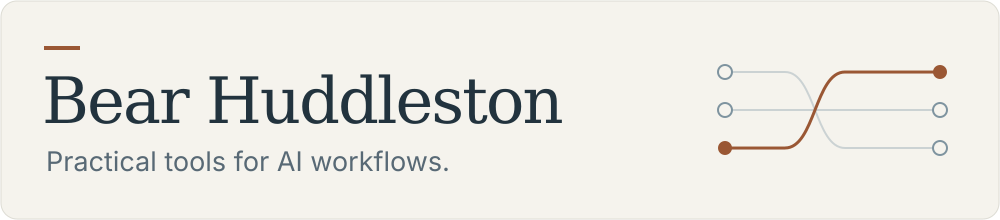
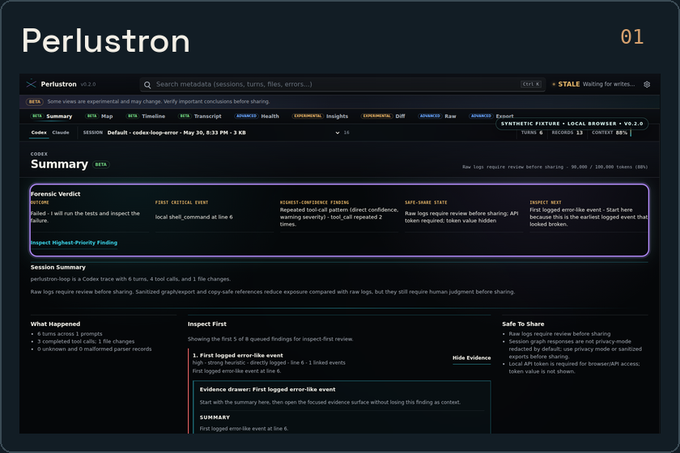
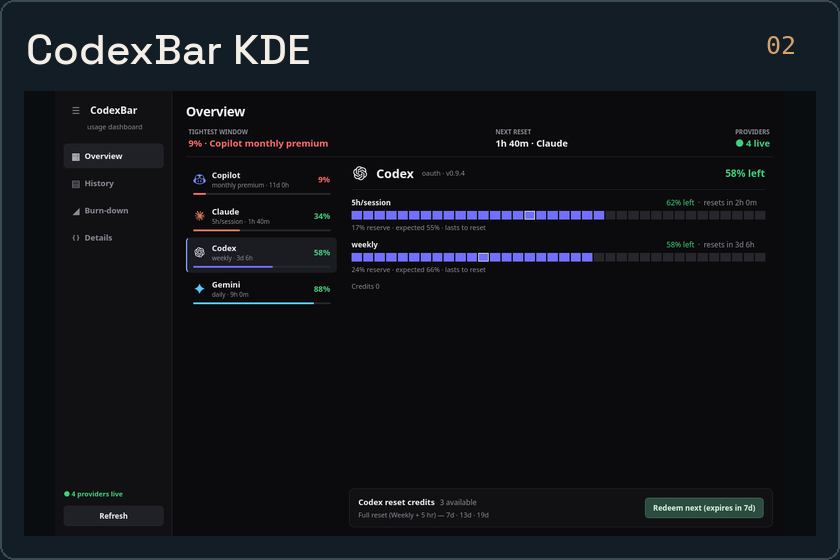
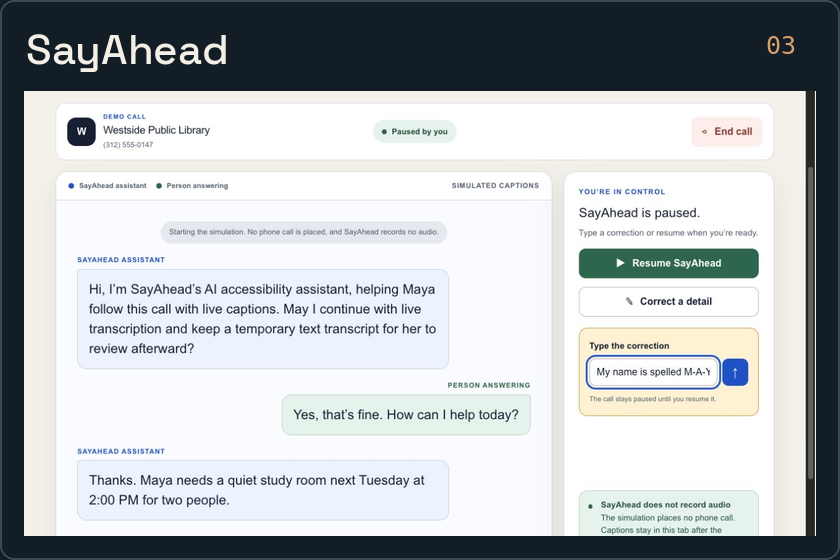

<picture>
  <source media="(prefers-color-scheme: dark)" srcset="assets/header-dark.svg">
  <source media="(prefers-color-scheme: light)" srcset="assets/header-light.svg">
  
</picture>

Senior AI Platform Engineer at [Exodus](https://exodus.com). I build tools that make AI workflows easier to inspect, control, and use.

[Email](mailto:bear@bearhuddleston.dev) · [LinkedIn](https://www.linkedin.com/in/bearhuddleston) · [Work GitHub](https://github.com/Bewarden)

## Selected work

  
  
  

- **[Perlustron](https://github.com/BearHuddleston/perlustron)** — Inspect coding-agent sessions, trace failures, compare runs, and export redacted reports. Runs locally. [Download →](https://github.com/BearHuddleston/perlustron/releases)
- **[CodexBar KDE](https://github.com/BearHuddleston/codexbar-kde)** — Keep AI subscription usage, history, and pacing in one Linux desktop dashboard. [Download →](https://github.com/BearHuddleston/codexbar-kde/releases)
- **[SayAhead](https://github.com/BearHuddleston/sayahead)** — A Build Week accessibility prototype for phone calls with captions and typed guidance. [Simulated demo →](https://call-assist-accessible-calls.bearhuddleston.chatgpt.site/) · [Watch](https://youtu.be/l9JLMYTbUMs)

## Open source

- **Hermes Agent** · [Remote HTML previews over SSH](https://github.com/NousResearch/hermes-agent/pull/76008) · merged
- **CodexBar** · [Handle logged-out Claude CLI sessions](https://github.com/steipete/CodexBar/pull/2070) · merged
- **T3 Code** · [Networking and server-to-server federation](https://github.com/pingdotgg/t3code/pull/9525) · under review

---

Previously at **OpenText / AppRiver**, working on ML, threat research, and data systems. Most of my public work uses **Rust, Python, and TypeScript**.
